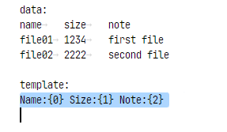
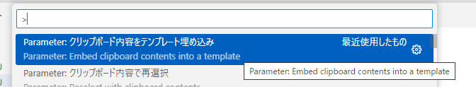
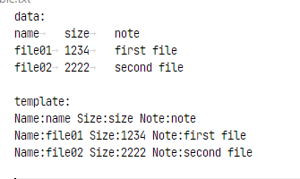
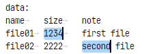
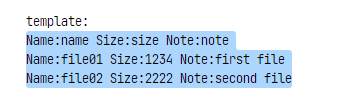
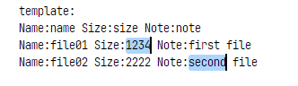

# 機能説明

## クリップボード内容をテンプレート埋め込み

1. まず、dataの全体をコピーします。dataはタブ区切りである必要があります。

2. templateを選択します。
templateは`{0}`のようなカッコと数値の文字列を置換します。

`{0}'の数値は列のインデックスになります。クリップボード内のdataが複数行ある場合は、行数分の置換されたtemplateが作成されます。

3. 次にメニューから「クリップボード内容をテンプレート埋め込み」を実行します。

4. templateの文字列が埋め込まれて次のような結果になります。

## クリップボード内容で再選択

1. クリップボードに再選択したい文字列をコピーします。

2. 再選択したい範囲を選択します。

3. メニューから「クリップボード内容で再選択」を実行すると、再選択されます。

