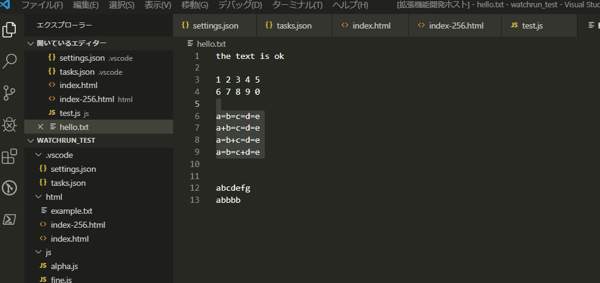
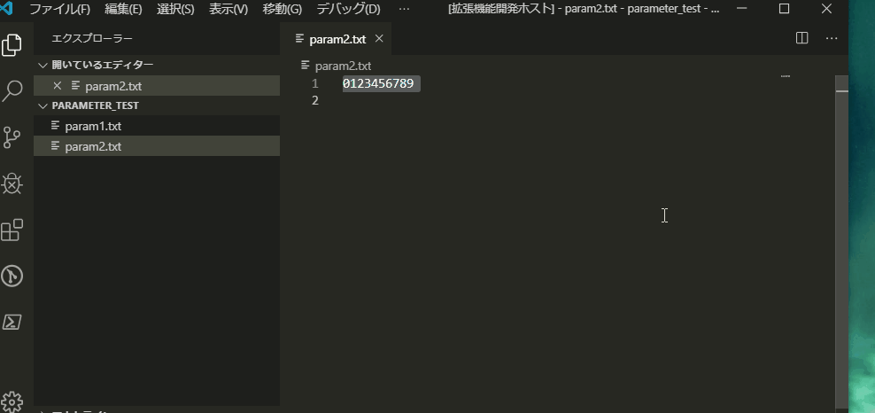
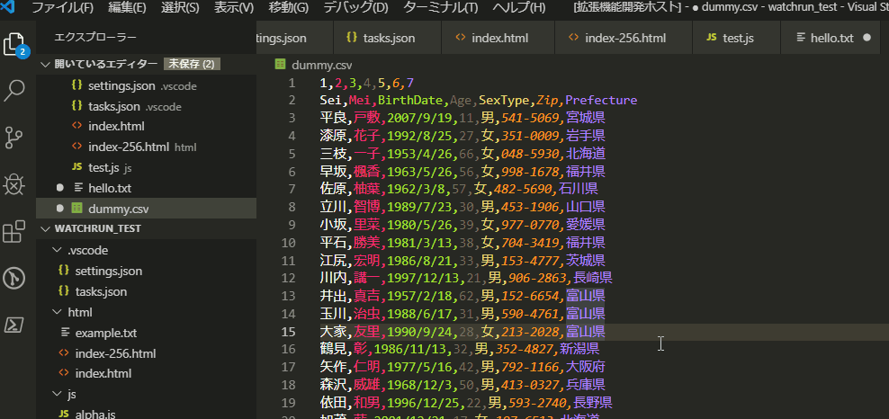

# Parameter Maker README

## Features

The Extension has the following function.

- Append Text to end of Selections
- Surround the Selections with Text
- Make Selections from Text
- Make Selections with RegExp separator
- Join N lines at a line
- Copy Selections N times
- Filter Selection by Index In Line
- Select Text By Line

## Gif

* Make Selections with RegExp separator

* Surround the Selections with Text

* Copy Selections N times

* Join N lines at a line

* Filter Selection by Index In Line

* Surround the Selections with Text

## Release Notes

[CHANGELOG.md](CHANGELOG.md)

