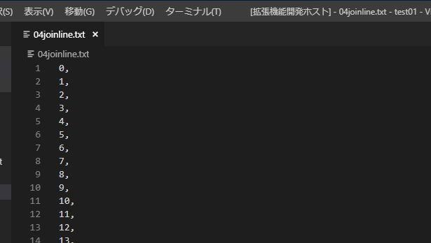

# Parameter Maker README

## Features

The Extension has the following function.

- Convert Selected Text to Parameters
- Convert Selected Text to Parameters By Input Seperator and Enclose
- Convert Selected Tab Text to Parameters
- Convert Selected Tab Text to Parameters By Input Enclose
- Convert Selected Multiline Text to Parameters
- Convert Selected Multiline Text to Parameters By Input Enclose
- Join N Lines at a Line
- Add Comma to End of Selected Lines

Default charactors to seperate text and enclose parameter are Configurated the following.

## Configuration

- parameter-maker.defaultSeperator 
Character that separates selected text. Default is []
- parameter-maker.defaultEnclose
Character that encloses parameter.
- parameter-maker.defaultJoinLines
the default number N to join lines at a line

### Selected Multiline Text to Parameters

### Selected Tab Text to Parameters

### Join N Lines at a Line

## Release Notes

### 0.0.3
- Improved Command name.
- Changed behavior of join parameters.
- Added join at a line command.
- Added comma to line ends command.

### 0.0.2
- Added MultiLine commands.
- Added fixed seperator commands.

### 0.0.1

First Release.
