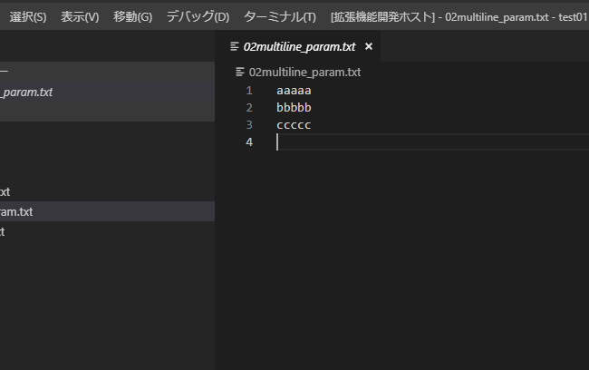
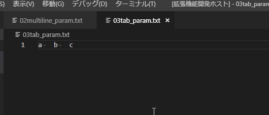

# Parameter Maker README

## Features

The Extension has the following function.

- Convert Selected Text to Parameters
- Convert Selected Text to Parameters With Input
- Convert Selected Multiline Text to Parameters
- Convert Selected Tab Text to Parameters
- Convert Selected Multiline Text to Parameters With Input
- Convert Selected Tab Text to Parameters With Input

## Configuration
 - parameter-maker.*

### Selected Multiline Text to Parameters

### Selected Tab Text to Parameters

## Release Notes

### 0.0.2
- Added MultiLine commands.
- Added fixed seperator commands.

### 0.0.1

First Release.
