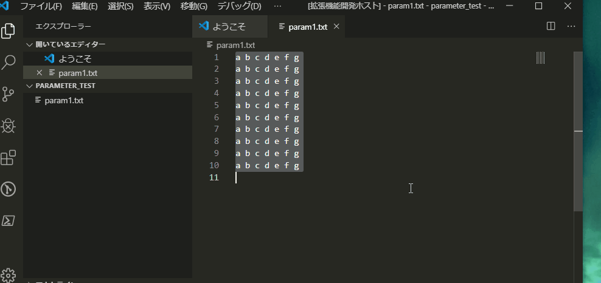
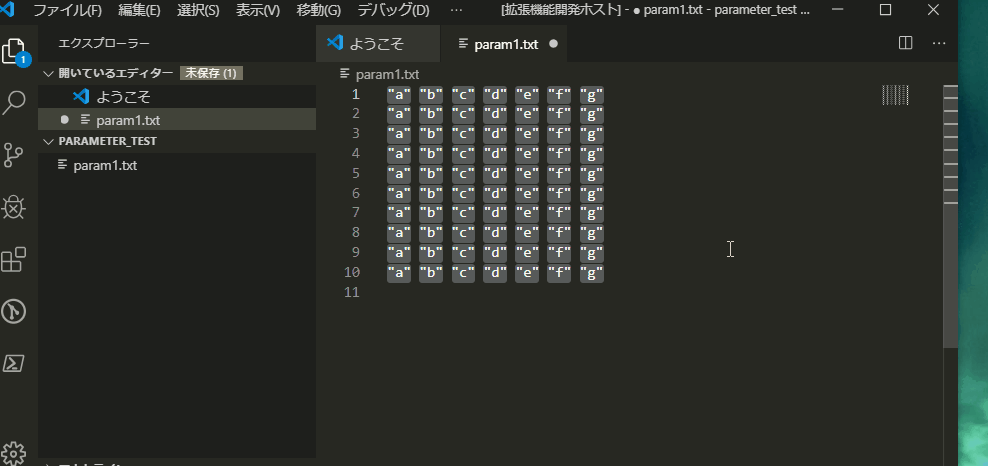
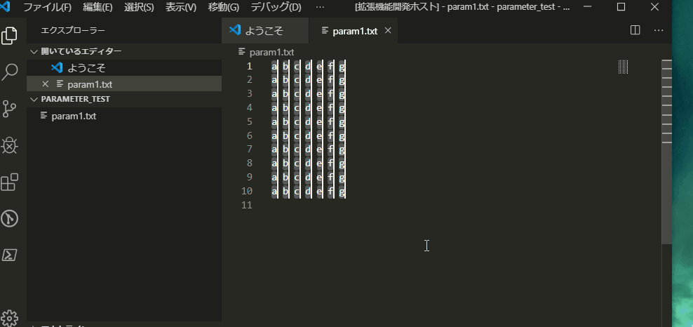
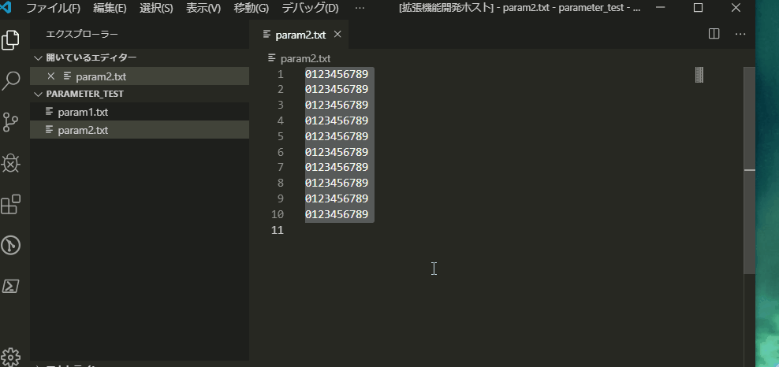

# Parameter Maker README

## Features

The Extension has the following function.

- Add Text to the end of Selection
- Surround the Selections with Text
- Add Selections from Text
- Join N lines at a line
- Copy Selections N times

## Gif
* Add Selections from Text

* Add Text to the end of Selection

* Surround the Selections with Text

* Copy Selections N times

* Join N lines at a line

## Release Notes

[CHANGELOG.md](CHANGELOG.md)

