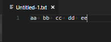
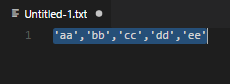

# Parameter Maker README

## Features

the Extension has following function.

- Convert selected text to be able to use parameters for array initialization. 

### before

### after

## Release Notes

### 0.0.1

First Release.
