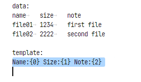
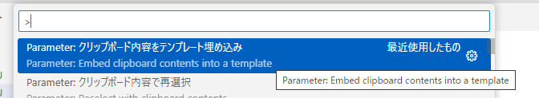
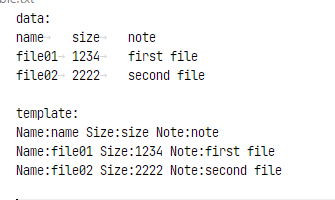
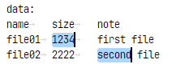
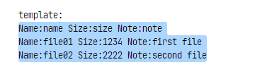
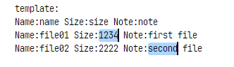

* [FUNCTION.md](FUNCTION.md)
* [FUNCTION.ja.md](FUNCTION.ja.md)

# Function Description

## Embed clipboard contents into a template

1. First, copy the entire data. The data must be tab-separated.

2. Select a template. The template replaces the strings with curly braces and numbers, such as {0}.

The number inside the {} corresponds to the index of the column. If the data in the clipboard has multiple lines, the replaced templates will be created for each line.

3. Then, execute "Embed clipboard contents into a template" from the menu.

4. The template string is embedded, resulting in the following output.
 

## Reselect with clipboard contents

1. Copy the string you want to reselect to the clipboard.

2. Select the range you want to reselect.

3. Execute "Reselect with clipboard contents" from the menu to reselect the range.

